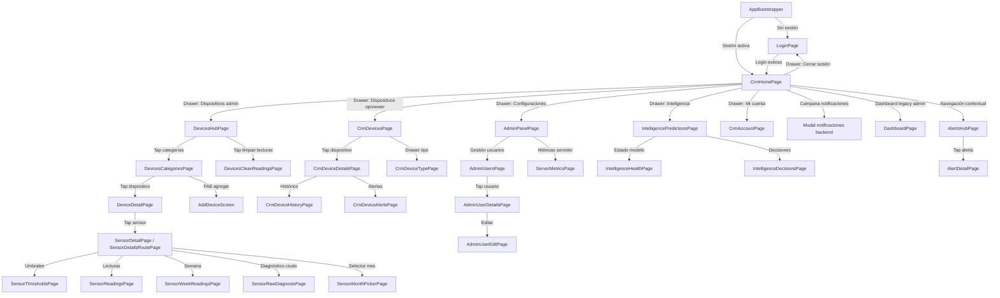

# IoT Monitoring Dashboard — UX Flow Documentation

Documentación técnica completa del flujo de experiencia de usuario (UX Flow) para la aplicación Flutter `iot_monito_dashboard`. Cada módulo tiene su propio archivo de análisis detallado.

## Índice de flows documentados

1. **[Autenticación y Sesión](auth-flow.md)**
   - `LoginPage`, `AppBootstrapper`
   - Flujo de inicio de sesión, persistencia de sesión y cierre de sesión.

2. **[CRM Dashboard y Shell](crm-dashboard-flow.md)**
   - `CrmHomePage`, `CrmDashboardContent`, `CrmDrawer`, `CrmAccountPage`, `CrmDevicesPage`, `CrmDeviceDetailsPage`, `CrmDeviceHistoryPage`, `CrmDeviceAlertsPage`, `CrmDeviceTypePage`
   - Shell principal post-login, navegación lateral y vistas de dispositivos/alerts para operator/viewer.

3. **[Dispositivos y Provisioning](devices-flow.md)**
   - `DevicesHubPage`, `DevicesCategoriesPage`, `DevicesListPage`, `DevicesByCategoryPage`, `DeviceDetailPage`, `SensorDetailPage`, `AddDeviceScreen`, `DevicesCleanReadingsPage`, `SensorThresholdsPage`
   - Ciclo de vida de dispositivos IoT, creación, definición de sensores, activación física (publish/reserve/confirm) y mantenimiento.

4. **[Monitoreo y Telemetría](monitoring-flow.md)**
   - `DashboardPage` (legacy admin), `SensorReadingsPage`, `SensorWeekReadingsPage`, `SensorMonthPickerPage`, `SensorRawDiagnosisPage`
   - Visualización de lecturas históricas, diagnóstico crudo y dashboard legacy con polling.

5. **[Alertas y Gestión de Incidentes](alerts-flow.md)**
   - `AlertsHubPage`, `AlertDetailPage`
   - Centro de alertas unificadas (umbral + ML), filtrado por sensor, snapshot inmutable y acciones ack/resolve.

6. **[Centro de Inteligencia (ML)](intelligence-flow.md)**
   - `IntelligencePredictionsPage`, `IntelligenceHealthPage`, `IntelligenceDecisionsPage`
   - Predicciones ML, salud de modelos, diagnóstico del orchestrator y decisiones recomendadas.

7. **[Administración del Sistema](admin-flow.md)**
   - `AdminPanelPage`, `AdminUsersPage`, `AdminUserDetailsPage`, `AdminUserEditPage`, `ServerMetricsPage`
   - Gestión de usuarios (CRUD) y métricas del servidor de telemetría.

---

## Tabla resumen de todos los endpoints del proyecto

| Endpoint | Método | Módulo / Pantalla(s) | Dato crítico que retorna | Auth requerida |
|----------|--------|----------------------|--------------------------|----------------|
| `/auth/login-token` | POST | Auth / LoginPage | `access_token`, `refresh_token`, `role`, `user` | No |
| `/auth/me` | GET | CRM / CrmAccountPage | Datos del usuario autenticado | Sí |
| `/admin/users` | GET | Admin / AdminUsersPage | Lista de usuarios | Sí (admin) |
| `/admin/users` | POST | Admin / AdminUsersPage (crear) | Usuario creado | Sí (admin) |
| `/admin/users/{id}` | PUT | Admin / AdminUserEditPage | Usuario actualizado | Sí (admin) |
| `/admin/users/{id}` | DELETE | Admin / AdminUsersPage, AdminUserDetailsPage | Confirmación de eliminación | Sí (admin) |
| `/crm/dashboard` | GET | CRM / CrmDashboardContent | KPIs, alertas recientes, top devices | Sí |
| `/crm/devices` | GET | CRM / CrmDevicesPage, CrmDeviceTypePage | Lista paginada de dispositivos | Sí |
| `/crm/devices/{id}/profile-full` | GET | CRM / CrmDeviceDetailsPage, CrmDeviceHistoryPage | Perfil completo con sensores y métricas | Sí |
| `/crm/alerts` | GET | CRM / CrmDeviceAlertsPage, Alerts / AlertsHubPage | Alertas históricas filtradas | Sí |
| `/crm/alerts/{id}/ack` | POST | Alerts / AlertDetailPage | Confirmación de acknowledge | Sí (admin/operator) |
| `/crm/alerts/{id}/resolve` | POST | Alerts / AlertDetailPage | Confirmación de resolución | Sí (admin/operator) |
| `/crm/alerts/{id}/snapshot` | GET | Alerts / AlertDetailPage | Serie temporal congelada + umbrales | Sí |
| `/devices/create` | POST | Devices / AddDeviceScreen | `deviceUuid` | Sí (admin) |
| `/devices/{uuid}/prepare-activation` | POST | Devices / AddDeviceScreen (legacy) | QR data para firmware | Sí (admin) |
| `/devices/{uuid}/sensors` | POST | Devices / AddDeviceScreen (legacy) | Sensor creado | Sí (admin) |
| `/devices/{uuid}/sensors/define` | POST | Devices / AddDeviceScreen | `sensorUuid` | Sí (admin) |
| `/devices/sensors/{uuid}/publish` | POST | Devices / AddDeviceScreen | Estado publicado | Sí (admin) |
| `/devices/sensors/claimable` | GET | Devices / AddDeviceScreen (instalador) | Sensores pendientes de claim | Sí |
| `/devices/sensors/{uuid}/reserve` | POST | Devices / AddDeviceScreen | `claimToken` | Sí (admin/instalador) |
| `/devices/sensors/confirm` | POST | Devices / AddDeviceScreen | `apiKey` (solo una vez) | Implícita (claim token) |
| `/devices/{id}` | PATCH | Devices / DeviceDetailPage (update name) | Mensaje de confirmación | Sí (admin) |
| `/devices/{id}` | DELETE | Devices / DeviceDetailPage | Mensaje de confirmación | Sí (admin) |
| `/devices/sensors/{id}` | PATCH | Devices / SensorDetailPage (update name) | Sensor actualizado | Sí (admin) |
| `/devices/sensors/{id}` | DELETE | Devices / SensorDetailPage | Sensor eliminado | Sí (admin) |
| `/monitoring/devices` | GET | Monitoring / DashboardPage, DevicesCategoriesPage | Dispositivos con sensores | Sí |
| `/monitoring/readings/latest` | GET | Monitoring / DashboardPage, DevicesCategoriesPage | Últimas lecturas por sensor | Sí |
| `/monitoring/sensors/{id}/readings` | GET | Monitoring / SensorReadingsPage, SensorWeekReadingsPage | Lecturas históricas | Sí |
| `/monitoring/sensors/{id}/raw-readings` | GET | Monitoring / SensorRawDiagnosisPage | Lecturas crudas | Sí |
| `/monitoring/sensors/{id}/aggregated` | GET | Monitoring / SensorDetailPage (dashboard) | Lecturas agregadas por bucket | Sí |
| `/monitoring/sensors/{id}/historical-readings` | GET | Monitoring / [Pendiente] | Lecturas filtradas por rango | Sí |
| `/monitoring/sensors/{id}/threshold-profile` | GET | Devices / SensorThresholdsPage | Perfil de umbrales del sensor | Sí |
| `/monitoring/sensors/{id}/threshold-profile` | PATCH | Devices / SensorThresholdsPage | Perfil actualizado | Sí (admin) |
| `/monitoring/sensors/{id}/thresholds` | GET | Devices / SensorThresholdsPage | Lista de umbrales | Sí |
| `/monitoring/sensors/{id}/thresholds` | POST | Devices / SensorThresholdsPage | Umbral creado | Sí (admin) |
| `/monitoring/thresholds/{id}` | PATCH | Devices / SensorThresholdsPage | Umbral editado | Sí (admin) |
| `/monitoring/thresholds/{id}` | DELETE | Devices / SensorThresholdsPage | Umbral desactivado | Sí (admin) |
| `/monitoring/thresholds/{id}/history` | GET | Devices / SensorThresholdsPage | Historial de cambios | Sí |
| `/monitoring/alerts/active` | GET | Alerts / AlertsHubPage (via AlertsRepository) | Alertas de umbral activas | Sí |
| `/monitoring/predictions` | GET | Monitoring+CRM / DashboardCubit, CrmDashboardContent | Predicciones ML | Sí |
| `/monitoring/ml-events/active` | GET | Alerts / AlertsHubPage (via AlertsRepository) | Eventos ML activos | Sí |
| `/monitoring/ml-health` | GET | Intelligence / IntelligenceHealthPage | Estado general del sistema ML | Sí |
| `/sensors/{id}/status` | GET | Monitoring / SensorDetailPage | Status consolidado del sensor | Sí |
| `/sensors/status/batch` | GET | Monitoring / DashboardPage | Status de múltiples sensores | Sí |
| `/notifications/unread` | GET | Notifications / DashboardPage, NotificationStateService | Notificaciones no leídas | Sí |
| `/notifications/mark-read` | POST | Notifications / DashboardPage, NotificationStateService | Confirmación de lectura | Sí |
| `/notifications/clear-all` | POST | Notifications / NotificationStateService | Limpieza de notificaciones | Sí |
| `/intelligence/predictions` | GET | Intelligence / IntelligencePredictionsPage | Predicciones ML resumidas | Sí |
| `/intelligence/decisions` | GET | Intelligence / IntelligenceDecisionsPage | Decisiones recomendadas | Sí |
| `/intelligence/decisions/{id}/status` | PATCH | Intelligence / IntelligenceDecisionsPage | Decisión actualizada | Sí |
| `/diagnostics/ml/model-status` | GET | Intelligence / IntelligenceHealthPage | Métricas técnicas del modelo | Sí (vía telemetry) |
| `/diagnostics/orchestrator/insights` | GET | Intelligence / IntelligenceHealthPage | Narrativa de análisis ML | Sí (vía telemetry) |
| `/telemetry/system/all` | GET | Metrics / ServerMetricsPage | CPU, RAM, ingesta, BD | No (público telemetry) |
| `/telemetry/system` | GET | Metrics / MetricsRepository (fallback) | CPU/RAM básico | No |
| `/telemetry/system/database` | GET | Metrics / MetricsRepository | Métricas de base de datos | No |
| `/telemetry/system/ingest` | GET | Metrics / MetricsRepository | Métricas de ingesta | No |
| `/telemetry/ml-features/latest/{sensorId}` | GET | Devices / MLFeaturesService | Features ML más recientes | No (telemetry) |
| `/telemetry/ml-features/history/{sensorId}` | GET | Devices / MLFeaturesService | Historial de features ML | No (telemetry) |
| `/telemetry/ml-features/latest/batch` | POST | Devices / MLFeaturesService | Features batch por sensor | No (telemetry) |
| `/monitoring/dev-tools/sensor-readings/all` | DELETE | Devices / DevicesCleanReadingsPage | Confirmación de eliminación | Sí (admin) |
| `/monitoring/dev-tools/sensor-readings/sensor/{id}` | DELETE | Devices / DevicesCleanReadingsPage | Confirmación de eliminación | Sí (admin) |

---

## Lista priorizada de mejoras UX

### Impacto Alto
1. **Eliminación de datos sin confirmación** (`DevicesCleanReadingsPage`)
   - DELETE de lecturas se ejecuta sin modal de confirmación explícita ni explicación de consecuencias.
   - **Impacto**: Pérdida irreversible de datos históricos por error de tap.

2. **Polling agresivo sin lifecycle awareness**
   - `ServerMetricsPage`, `SensorRawDiagnosisPage` y `DashboardPage` hacen polling cada 10 segundos sin pausar en background.
   - **Impacto**: Consumo innecesario de batería y datos; posibles crashes por timers acumulados.

3. **Carga deliberadamente retardada del CRM Dashboard**
   - `CrmDashboardContent` retrasa la carga de datos 1.2-5 segundos para evitar freeze.
   - **Impacto**: El usuario ve una pantalla vacía o skeleton sin contenido relevante por varios segundos.

4. **Recarga completa de alertas para obtener una sola**
   - `AlertDetailPage.getAlertById` descarga 200 alertas y filtra en cliente.
   - **Impacto**: Lentitud y consumo de red escalando con el histórico.

### Impacto Medio
5. **Ausencia de paginación en listas pesadas**
   - `AdminUsersPage`, `AlertsHubPage`, `CrmDevicesPage` cargan listas fijas (100-200 items) sin scroll infinito.
   - **Impacto**: Degradación de performance con escalamiento de datos.

6. **Falta de feedback post-acción en administración**
   - Crear/editar/eliminar usuario no muestra toast/snackbar de confirmación.
   - **Impacto**: El usuario no recibe confirmación inmediata de que su acción tuvo efecto.

7. **Drawer sin indicador de ruta activa**
   - `CrmDrawer` marca "Dashboard" como seleccionado siempre, incluso cuando el usuario está en otra pantalla.
   - **Impacto**: Desorientación sobre ubicación actual en la app.

8. **Validación mínima en formularios de usuario**
   - `AdminUserEditPage` y `user_dialog.dart` solo validan campos no vacíos.
   - **Impacto**: Se pueden crear usuarios con emails inválidos o contraseñas débiles.

### Impacto Bajo
9. **Sensores omitidos arbitrariamente en vista semanal**
   - `SensorWeekReadingsPage` filtra solo lecturas de tarde (12:00-22:59) y máximo 10.
   - **Impacto**: El usuario no sabe que existen más datos fuera de ese rango.

10. **Precarga de inteligencia**
    - Los endpoints de telemetría ML (`/diagnostics/*`) podrían precargarse al abrir el drawer.
    - **Impacto**: Mejora percepción de velocidad en `IntelligenceHealthPage`.

11. **Cache local de notificaciones y alertas**
    - `AlertsHubPage` y notificaciones de campana no tienen caché de corto plazo.
    - **Impacto**: Navegación rápida entre pantallas dispara requests redundantes.

---

## Diagrama de flujo de navegación

---

## Convenciones del proyecto

- **Estado**: `flutter_bloc` (Cubit) en `DashboardCubit` únicamente. Resto de pantallas usan `StatefulWidget` + `setState` + `FutureBuilder` / `ValueNotifier`.
- **Navegación**: `MaterialApp.onGenerateRoute` (`AppRouter`) para rutas dinámicas (`/device/:id`, `/sensor/:id`, `/devices/create`). Navegación imperativa (`Navigator.push`) para el resto.
- **Repositorios**: Patrón Singleton manual (factory + constructor privado). Todos usan `ApiClient` (también singleton) salvo `MetricsRepository` e `IntelligenceRepository` que hablan directamente con el telemetry server.
- **Auth**: Token JWT global en `ApiClient.authToken`. Persistencia via `AuthStorage` (`flutter_secure_storage` / `shared_preferences`). Roles: `admin`, `operator`, `viewer`.
- **Temas**: Dark mode fijo (`AppTheme.dark()`), localización `es_CO`.
